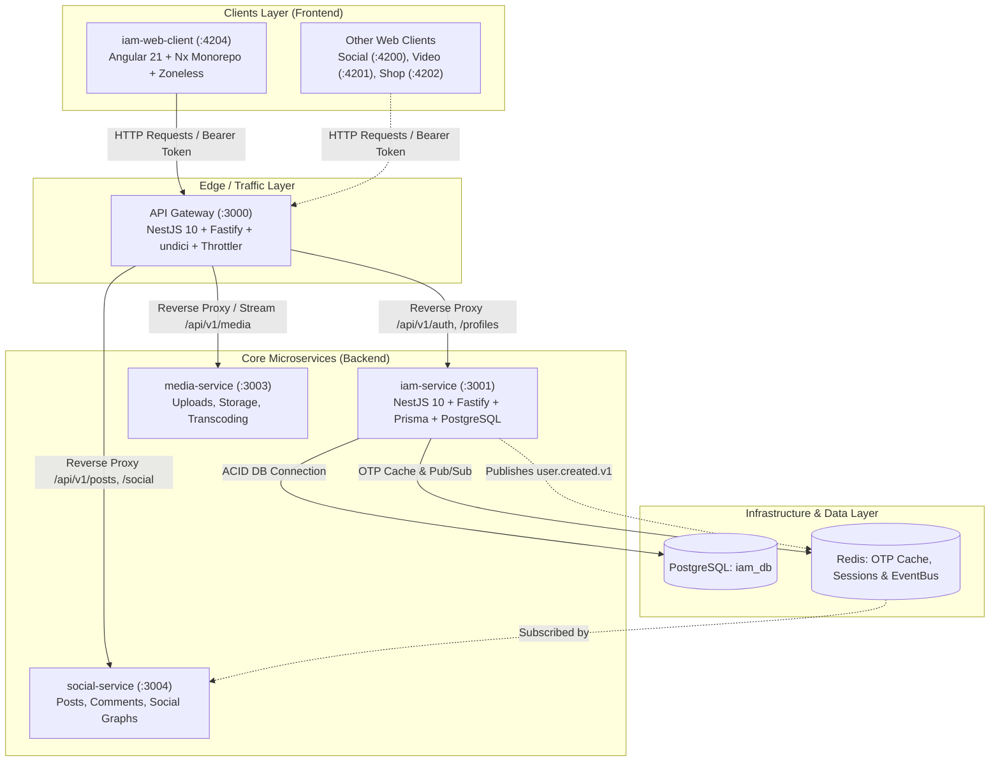

# Static Knowledge: Architecture

Tập hợp tài liệu thiết kế và snapshot kiến trúc chi tiết của các dịch vụ, ứng dụng frontend và thành phần hạ tầng trong hệ sinh thái **Reals Platform**. Tài liệu này đóng vai trò làm chuẩn kiến trúc (Architectural Baseline), hỗ trợ con người và các AI coding agents hiểu rõ ranh giới dịch vụ, cơ chế giao tiếp và định hướng cải tiến hệ thống.

---

## 1. Bản đồ Kiến trúc 3 Thành phần Cốt lõi (Snapshot)

---

## 2. Danh mục Tài liệu Kiến trúc Chi tiết

| Tài liệu | Thành phần | Trách nhiệm chính | Tech Stack |
|---|---|---|---|
| [**API Gateway Architecture**](./gateway-architecture.md) | `services/gateway` | Public Edge Router, Single Envelope Normalization, Rate Limiting, JWT Guard, Streaming Proxy | NestJS 10, Fastify, undici, Throttler |
| [**IAM Service Architecture**](./iam-service-architecture.md) | `services/iam-service` | Identity Management, Multi-Factor Auth (Email/Phone OTP), Session Rotation, RBAC, Domain Events | NestJS 10, Fastify, Prisma ORM, PostgreSQL, Redis, Argon2 |
| [**IAM Web Client Architecture**](./iam-web-client-architecture.md) | `frontend/iam-web-client` | SSO Portal, Ecosystem Fullsite Showcase Landing, State Management via Signals, Nginx Production Shell | Angular 21 (Zoneless), Nx 22, TailwindCSS v4, RxJS, Nginx |
| [**Stories Service Architecture**](./stories-service-snapshot.md) | `services/stories-service` | Novel Reading Platform (Novels, Chapters, Reading Progress, Reviews, Analytics, Wallet, Monetization) | NestJS 10, Fastify, Prisma ORM (@prisma/client-reading), PostgreSQL, Redis |
| [**Stories Web Client Architecture**](./stories-web-client-snapshot.md) | `frontend/stories-web-client` | Web Client for Reading, Discovery, Library, Creator Studio | Angular 21 (Zoneless), Nx 22, TailwindCSS v4, RxJS |

---

## 3. Các Nguyên tắc Kiến trúc Cốt lõi (Architectural Guiding Principles)

1. **Database-per-Service & Domain Isolation:**
   - Mỗi microservice sở hữu toàn quyền một cơ sở dữ liệu riêng biệt. Tuyệt đối không query cross-database hoặc import relative path giữa các microservice.
2. **Edge Gateway as Single Public Boundary:**
   - Client ngoài chỉ được phép gọi vào `services/gateway` (`:3000`). Mọi response đều được chuẩn hóa qua một tầng Envelope duy nhất (`{ statusCode, data, message, meta }`), loại bỏ hoàn toàn hiện tượng double wrapping.
3. **Zoneless & Signals-First Frontend:**
   - Ứng dụng Web loại bỏ `zone.js` (`provideZonelessChangeDetection`), quản lý trạng thái phản ứng trực tiếp qua Angular Signals để đạt hiệu năng tối đa và giảm bundle size.
4. **Shared Platform Packages via Published SDKs:**
   - Mã nguồn dùng chung (Logging, Tracing, Security, Http Common, Config, Event Contracts) được đóng gói độc lập trong repository `platform/` và phát hành dưới dạng package `@daccuong-uit/*`.
5. **Event-Driven Eventual Consistency:**
   - Đồng bộ dữ liệu liên vi dịch vụ được thực hiện bất đồng bộ thông qua EventBus (`@daccuong-uit/platform-event-bus`) dựa trên Redis/Kafka.
