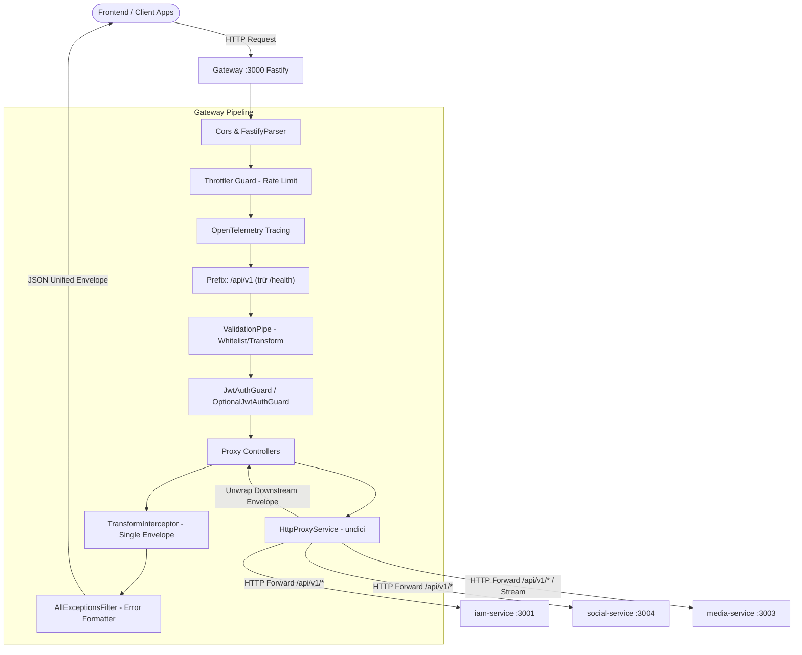

# Kiến Trúc Dịch Vụ: API Gateway (`services/gateway`)

> **Phiên bản:** 1.0.0 (Snapshot hiện tại)  
> **Trạng thái:** Active / Stable  
> **Phạm vi:** Cổng vào HTTP công khai (Public Edge Gateway / Reverse Proxy Router)

---

## 1. Tổng quan & Vai trò

`services/gateway` (`@app/gateway`) là điểm tiếp nhận lưu lượng mạng HTTP/HTTPS duy nhất từ các client bên ngoài (Web, Mobile, Third-party) vào hệ sinh thái microservices. 

### Trách nhiệm chính
- **Routing & Reverse Proxying:** Chuyển tiếp requests đến đúng downstream service (`iam-service`, `social-service`, `media-service`).
- **Edge Authentication & Guards:** Giải mã, xác thực JWT access token ở tầng biên (`JwtAuthGuard`, `OptionalJwtAuthGuard`) và đính kèm thông tin danh tính (`request.user`) vào ngữ cảnh yêu cầu.
- **Throttling / Rate Limiting:** Bảo vệ hệ thống khỏi lạm dụng và tấn công DoS/brute-force bằng `@nestjs/throttler`.
- **Envelope Normalization (Phòng chống Double-Wrapping):** Bóc tách vỏ bọc response chuẩn (`ApiSuccessResponse`) từ downstream service và đóng gói thống nhất một tầng duy nhất trước khi trả về cho Frontend.
- **Error Normalization:** Đồng bộ hóa định dạng lỗi (`ApiErrorResponse`), giữ nguyên chi tiết validation lỗi trường (`errors: Record<string, string[]>`) từ downstream để FE hiển thị thân thiện.
- **Binary/Stream Piping:** Hỗ trợ stream dữ liệu nhị phân (Media, file uploads) qua fastify multipart và streaming pipes trực tiếp mà không tiêu tốn RAM đệm.
- **API Documentation Aggregation:** Cung cấp Swagger UI tập trung tại `/docs`.

---

## 2. Tech Stack & Nền tảng

| Thành phần | Công nghệ / Thư viện | Lý do chọn lựa |
|---|---|---|
| **Runtime & Framework** | Node.js + NestJS 10 (Fastify Adapter) | Hiệu năng throughput cao hơn đáng kể so với Express (2-3x I/O rps) |
| **HTTP Client** | `undici` (Node Native Fetch engine) | Tốc độ HTTP pipelining vượt trội, tiết kiệm tài nguyên kết nối |
| **Bảo mật & Token** | `@daccuong-uit/platform-security-sdk` | Thư viện nội bộ chuẩn hóa xác thực JWT |
| **Rate Limiting** | `@nestjs/throttler` | Quản lý hạn mức request theo sliding/fixed window |
| **Shared Libs** | `@daccuong-uit/platform-http-common`, `platform-logger`, `platform-tracing`, `platform-config` | Đảm bảo logging, tracing, response envelope nhất quán |
| **Validation** | `class-validator`, `class-transformer`, `zod` | Validate payload đầu vào chặt chẽ |

---

## 3. Mô hình Kiến trúc & Luồng Xử lý

### Sơ đồ kiến trúc tầng biên



### Nguyên tắc xử lý Envelope chuẩn
1. **Downstream Service** trả về:
   ```json
   {
     "statusCode": 200,
     "data": { "userId": "...", "username": "..." },
     "message": "Thao tác thành công",
     "meta": { "timestamp": 123456 }
   }
   ```
2. **`HttpProxyService`**: Unwraps trường `data` và giữ lại `message`, trả về object phẳng cho Controller.
3. **Gateway's `TransformInterceptor`**: Đóng gói lại thành chuẩn API Gateway duy nhất cho Client:
   ```json
   {
     "statusCode": 200,
     "data": { "userId": "...", "username": "..." },
     "message": "Thao tác thành công",
     "meta": { "timestamp": 123456 }
   }
   ```
   *Cơ chế này loại bỏ hoàn toàn hiện tượng "Double Wrapping" `{ statusCode: 200, data: { statusCode: 200, data: ... } }`.*

---

## 4. Cấu trúc thư mục (`services/gateway/src`)

```
services/gateway/src/
├── main.ts                     # Khởi tạo Fastify app, Tracing, Swagger, Pipes, Filters
├── app.module.ts               # Root module kết nối Throttler và các Proxy Modules
├── config/
│   └── app.config.ts           # Schema zod cấu hình môi trường (Port, JWT, Service URLs)
├── common/
│   ├── guards/
│   │   └── jwt-auth.guard.ts   # JwtAuthGuard & OptionalJwtAuthGuard
│   └── services/
│       └── http-proxy.service.ts # Core proxy client sử dụng undici, streaming & unwrapping
├── health/
│   ├── health.controller.ts    # Liveness check (/health & /api/v1/health)
│   └── health.module.ts
└── proxy/
    ├── auth/                   # Proxy các routes /api/v1/auth/* -> IAM
    ├── identity/               # Proxy các routes /api/v1/profiles/* -> IAM
    ├── media/                  # Proxy các routes /api/v1/media/* -> Media Service
    └── social/                 # Proxy các routes /api/v1/posts, comments, feeds... -> Social
```

---

## 5. Đặc tả Router & Uỷ quyền Dịch vụ

| Tiền tố Route Gateway | Downstream Service | Nhiệm vụ chính |
|---|---|---|
| `/api/v1/auth/*` | `IAM_SERVICE_URL` | Đăng ký, đăng nhập, OTP SMS, Refresh token |
| `/api/v1/profiles/*` | `IAM_SERVICE_URL` | Lấy profile cá nhân (`/me`), tra cứu username/userId, cập nhật thông tin |
| `/api/v1/posts/*`, `/comments/*`, `/reels/*`, `/social/*` | `SOCIAL_SERVICE_URL` | Đăng bài, tương tác social, feed, theo dõi bạn bè |
| `/api/v1/media/*` | `MEDIA_SERVICE_URL` | Upload file, presigned upload URL, stream video/image |
| `/health` | Nội bộ Gateway | Health check phục vụ Docker/Kubernetes Liveness Probe |

---

## 6. Đánh giá Hiện trạng & Hướng Cải Tiến (Architecture Snapshot & Roadmap)

### Ưu điểm hiện tại
- **Stateless hoàn toàn:** Gateway không sở hữu database, khởi động cực nhanh và scale ngang (horizontal scaling) dễ dàng phía sau Load Balancer.
- **Fastify + undici:** Tối ưu hóa I/O, giảm độ trễ (latency overhead) của proxy layer xuống mức tối thiểu (< 5ms).
- **Phân tách trách nhiệm sạch sẽ:** Gateway chỉ điều phối, xác thực token tầng ngoài và định tuyến, không nhồi nhét nghiệp vụ domain logic.

### Điểm hạn chế & Hướng cải tiến tương lai
1. **Dynamic Service Discovery:**
   - *Hiện tại:* Dùng URL tĩnh qua biến môi trường (`IAM_SERVICE_URL`, `SOCIAL_SERVICE_URL`).
   - *Cải tiến:* Khi mở rộng sang cụm k8s hoặc mesh (Consul / Istio / CoreDNS), chuyển hướng định tuyến theo DNS động hoặc gRPC sidecar.
2. **Circuit Breaker & Retry:**
   - *Hiện tại:* Gọi trực tiếp downstream, nếu downstream timeout sẽ throw Bad Gateway 502/504 ngay lập tức.
   - *Cải tiến:* Tích hợp pattern Circuit Breaker (Cockatiel hoặc Opossum) để tự ngắt khi downstream quá tải, tránh cascade failure.
3. **Response Caching (Edge Cache):**
   - *Hiện tại:* Mọi GET request (kể cả profile tĩnh hoặc public feed) đều gọi downstream.
   - *Cải tiến:* Bổ sung Redis cache tầng Gateway cho các public idempotent GET requests với cache tagging/invalidation.
4. **BFF (Backend For Frontend) Aggregation:**
   - *Hiện tại:* Client muốn gom dữ liệu Profile + Social Posts phải gọi 2 request riêng biệt.
   - *Cải tiến:* Xem xét thêm layer tổng hợp (GraphQL Gateway hoặc BFF routes chuyên biệt) gom phản hồi nhiều service thành 1 roundtrip.
