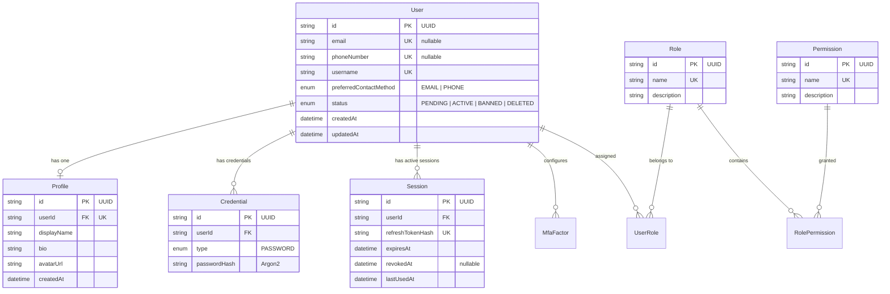
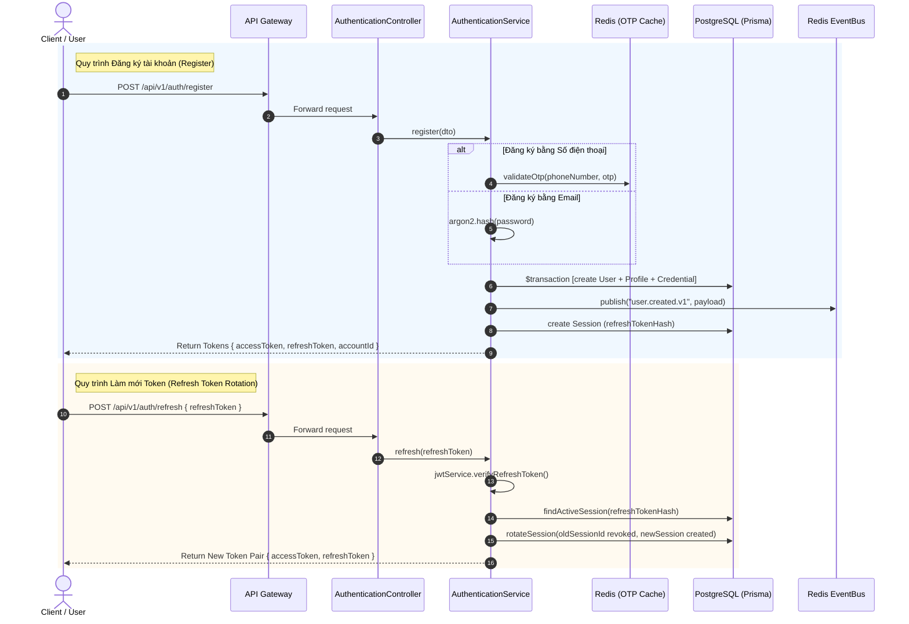

# Kiến Trúc Dịch Vụ: IAM Service (`services/iam-service`)

> **Phiên bản:** 1.0.0 (Snapshot hiện tại)  
> **Trạng thái:** Active / Production-Ready  
> **Phạm vi:** Identity and Access Management (Xác thực, Phân quyền, Hồ sơ danh tính và Quản lý phiên)

---

## 1. Tổng quan & Vai trò

`services/iam-service` (`@app/iam-service`) là vi dịch vụ chịu trách nhiệm trung tâm và độc quyền về mặt danh tính trong toàn bộ hệ sinh thái Reals Platform. Dịch vụ này sở hữu cơ sở dữ liệu độc lập `iam_db` (PostgreSQL) và không chia sẻ cơ sở dữ liệu trực tiếp với bất kỳ dịch vụ nào khác (Database-per-Service Pattern).

### Trách nhiệm cốt lõi
- **Authentication (Xác thực đa phương thức):** Đăng ký, đăng nhập qua Email/Mật khẩu hoặc Số điện thoại + mã xác thực OTP SMS.
- **Session Management & Token Rotation:** Quản lý phiên đăng nhập với kỹ thuật Refresh Token Rotation nhằm chống Replay Attack và thu hồi phiên (Revocation).
- **Identity & Profile Management:** Quản lý thông tin tài khoản `User` và hồ sơ hiển thị `Profile` (Tên hiển thị, tiểu sử, avatar).
- **Authorization & RBAC:** Hệ thống quyền hạn theo vai trò (Role-Based Access Control) với liên kết `Role` - `Permission`.
- **Domain Event Dispatching:** Phát sự kiện miền (Domain Events) bất đồng bộ (như `user.created.v1`) qua `EventBus` (Redis) để các dịch vụ khác (ví dụ: `social-service`) tự đồng bộ hóa dữ liệu.

---

## 2. Tech Stack & Cơ sở hạ tầng

| Thành phần | Công nghệ / Thư viện | Vai trò |
|---|---|---|
| **Framework** | NestJS 10 (Fastify Platform) | Web API framework hiệu năng cao |
| **Database** | PostgreSQL (`iam_db`) | Lưu trữ quan hệ ACID cho người dùng, phiên, quyền |
| **ORM / Migrations** | Prisma ORM 5 | Schema-first type-safe database access |
| **Cache & OTP** | Redis (`ioredis`) | Lưu mã OTP tạm thời (TTL 5 phút), rate limit OTP |
| **Event Bus** | `@daccuong-uit/platform-event-bus` (Redis PUB/SUB) | Giao tiếp bất đồng bộ liên dịch vụ |
| **Password Hashing** | `argon2` | Chuẩn mã hóa mật khẩu an toàn hiện đại nhất (chống GPU/ASIC cracking) |
| **Token SDK** | `@daccuong-uit/platform-security-sdk` | Ký và giải mã chuẩn JWT Access & Refresh Token |
| **Observability** | `@daccuong-uit/platform-tracing`, `platform-logger` | OpenTelemetry Distributed Tracing và Pino logger |

---

## 3. Kiến trúc Miền dữ liệu (Domain Data Model)

IAM Service phân tách rành mạch giữa thực thể **Tài khoản định danh (`User`)**, **Thông tin bảo mật (`Credential`)**, **Phiên đăng nhập (`Session`)**, và **Hồ sơ hiển thị (`Profile`)**.



---

## 4. Các Sub-modules & Luồng Nghiệp vụ (Subsystems)

Cấu trúc nội bộ của IAM Service tuân thủ mô hình **Modular Monolith**:

```
services/iam-service/src/
├── main.ts                     # Fastify bootstrap, tracing, validation, exceptions
├── app.module.ts               # Khai báo Config, Prisma, Event và các Sub-modules
├── config/
│   └── app.config.ts           # Schema zod cấu hình môi trường
├── common/
│   ├── events/                 # EventBus integration module
│   └── prisma/                 # PrismaService lifecycle connection module
├── health/                     # Health check controller
└── modules/
    ├── authentication/         # Đăng ký, Đăng nhập, OTP, Refresh Token
    ├── users/                  # Quản lý Profile (Create, Read, Update)
    ├── authorization/          # Quản lý Role, Permission, UserRole
    └── sessions/               # Lưu trữ, thu hồi, xoay vòng Session token
```

### 4.1. Luồng Xác thực & Phát hành Token (Authentication Flow)



### 4.2. Cơ chế Bảo mật Cốt lõi
1. **Argon2 Password Hashing:** Mật khẩu thô không bao giờ được lưu vào DB. Thuật toán `argon2` cung cấp khả năng kháng lại các cuộc tấn công Brute-force và Dictionary attack tốt hơn bcrypt.
2. **Refresh Token Rotation:** Khi refresh token được sử dụng, token cũ bị thu hồi ngay lập tức (`revokedAt = now()`) và một token mới được phát hành. Nếu một token đã bị thu hồi cố gắng refresh lần nữa, hệ thống có thể phát hiện hành vi tấn công và vô hiệu toàn bộ chuỗi phiên.
3. **Phone OTP with Time-to-Live:** Mã OTP số điện thoại lưu trữ trên Redis với thời hạn 300 giây (5 phút), mã hóa key `iam:otp:{phone}` và tự hủy sau khi verify thành công.
4. **Decoupled User - Profile:** Cho phép mở rộng hồ sơ (Bio, Avatar, Social metadata) mà không làm ảnh hưởng hay phình to bảng thông tin đăng nhập `User`.

---

## 5. Tương tác Liên Dịch vụ (Event-Driven Contracts)

Khi người dùng đăng ký thành công, IAM Service phát sự kiện:
- **Tên Event:** `user.created.v1`
- **Giao thức:** Redis EventBus (`@daccuong-uit/platform-event-bus`)
- **Hợp đồng (Contract):** `UserCreatedEvent` từ package `@daccuong-uit/contracts-events`
- **Downstream Consumers:** 
  - `services/social-service`: Lắng nghe để tự động khởi tạo Social Graph, thông tin Profile hiển thị cho mạng xã hội.
  - Các service phân tích / thông báo trong tương lai.

---

## 6. Đánh giá Hiện trạng & Hướng Cải Tiến (Architecture Snapshot & Roadmap)

### Ưu điểm hiện tại
- Phân tách rõ ràng giữa Bounded Context của IAM và các Service kinh doanh khác.
- Mô hình dữ liệu Prisma được chuẩn hóa cao (3NF), quan hệ ràng buộc khóa ngoại chặt chẽ (`Cascade Delete` từ User).
- Tích hợp chuẩn hoá toàn diện với bộ thư viện chung (`platform-*`), bảo đảm tính đồng nhất trong toàn công ty.

### Điểm hạn chế & Hướng cải tiến tương lai
1. **Transactional Outbox Pattern:**
   - *Hiện tại:* Sự kiện `user.created.v1` được phát sau khi hoàn tất `$transaction` Prisma bằng `EventBus.publish()`. Nếu Redis gặp sự cố đúng lúc này, sự kiện có thể bị mất.
   - *Cải tiến:* Áp dụng Transactional Outbox Pattern: Lưu event vào bảng `outbox_events` trong cùng transaction cơ sở dữ liệu, một background worker sẽ quét và dispatch sang Redis/Kafka đảm bảo At-Least-Once Delivery.
2. **OAuth2 / Social Identity Providers:**
   - *Hiện tại:* Mới chỉ hỗ trợ Email/Password và Phone OTP.
   - *Cải tiến:* Mở rộng bảng `Credential` để hỗ trợ Social Logins (Google OAuth2, Apple ID, Facebook, Github) bằng `provider` và `providerAccountId`.
3. **MFA TOTP Flow:**
   - *Hiện tại:* Bảng `MfaFactor` đã có sẵn schema nhưng controller/service chưa kích hoạt trọn vẹn quy trình QR code TOTP (Google Authenticator).
   - *Cải tiến:* Triển khai đầy đủ endpoint setup TOTP và verify TOTP trong luồng đăng nhập 2 lớp.
4. **Distributed Session Blacklist via Redis:**
   - *Hiện tại:* Session revocation được kiểm tra trong PostgreSQL qua bảng `sessions`.
   - *Cải tiến:* Đồng bộ các token bị revoke lên Redis Bloom Filter hoặc Redis Set để Gateway có thể từ chối ngay lập tức ở tầng biên mà không cần gọi vào IAM Service.
