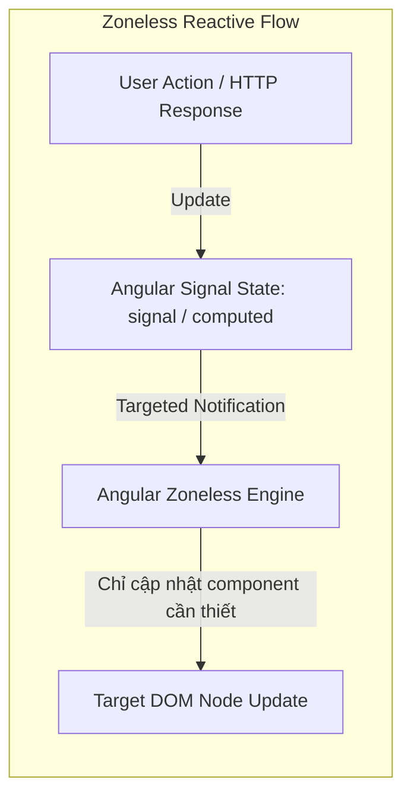
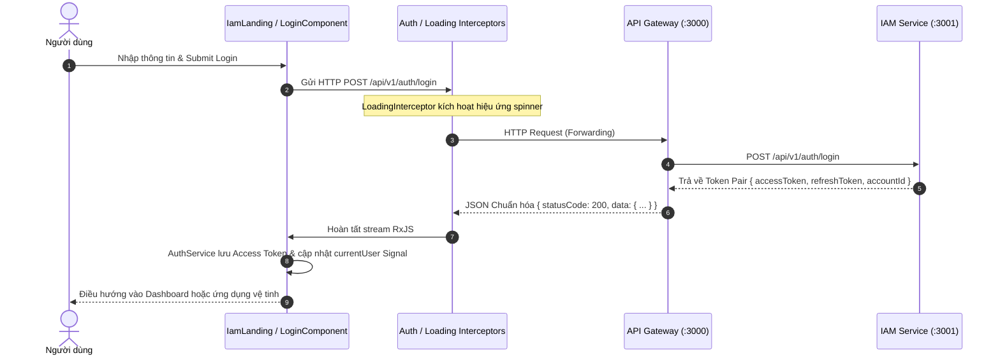

# Kiến Trúc Ứng Dụng: IAM Web Client (`frontend/iam-web-client`)

> **Phiên bản:** 1.0.0 (Snapshot hiện tại)  
> **Trạng thái:** Active / Production-Ready  
> **Phạm vi:** Single Sign-On (SSO) Portal, Ecosystem Landing Page & Fullsite Showcase

---

## 1. Tổng quan & Vai trò

`frontend/iam-web-client` là cổng vào (Single Point of Entry) của toàn bộ hệ sinh thái **Reals Platform**. Ứng dụng hoạt động tại cổng mặc định **Port 4204** (cả môi trường Dev lẫn Docker Production).

### Trách nhiệm chính
1. **SSO Identity Hub (Cổng Xác Thực Tập Trung):** Cung cấp các giao diện đăng ký (`/auth/register`), đăng nhập (`/auth/login`), phục hồi phiên và điều hướng người dùng đã xác thực sang các ứng dụng vệ tinh khác.
2. **Fullsite Showcase Landing Page:** Trang chủ (`/`) giới thiệu toàn cảnh hệ sinh thái Reals với 4 không gian trải nghiệm chính:
   - **Social Web Client** (Port 4200) - Mạng xã hội kết nối và thảo luận.
   - **Video Client** (Port 4201) - Trải nghiệm video ngắn Reels & Livestream.
   - **Shop Client** (Port 4202) - Nền tảng Social Commerce, cửa hàng người sáng tạo.
   - **Stories Client** (Port 4203) - Chia sẻ khoảnh khắc ngắn 24h.
   - **Portfolio** (Port 4205) - Hồ sơ kỹ sư Đắc Cường.
3. **Quản lý Ngữ cảnh Đăng nhập (Client Auth State):** Lưu trữ Access Token, Refresh Token, duy trì trạng thái đăng nhập qua `AuthService` và tự động gắn Bearer Token qua HTTP Interceptor.

---

## 2. Tech Stack & Nền tảng

| Lớp (Layer) | Công nghệ / Thư viện | Đặc điểm kiến trúc nổi bật |
|---|---|---|
| **Framework** | Angular 21 (Standalone Components) | Không sử dụng `NgModule`, 100% Standalone, Lazy Loading module theo route |
| **Change Detection** | **Zoneless** (`provideZonelessChangeDetection`) | Loại bỏ hoàn toàn `zone.js`, giảm kích thước bundle, render cực nhanh |
| **State Management** | **Angular Signals** + RxJS | Sử dụng Signals cho Local State & View State; RxJS cho Event Streams & Async HTTP |
| **Monorepo Architecture** | **Nx 22** | Quản lý mã nguồn theo cấu trúc thư viện phân lớp (Apps & Libs) |
| **Styling & Design System** | TailwindCSS v4 + OKLCH Tokens | Hệ thống token màu động, hỗ trợ theme linh hoạt, CSS custom properties |
| **Web Server Production** | Nginx Alpine (Multi-stage Docker) | Nén Gzip, cấu hình Security Headers, SPA Fallback và Reverse Proxy API |

---

## 3. Cấu trúc Monorepo & Kiến trúc Phân lớp (Nx Libs Architecture)

Ứng dụng tuân theo chuẩn **Enterprise Angular Monorepo Architecture** của Nx, chia nhỏ mã nguồn thành ứng dụng shell (`apps/`) và các thư viện chuyên biệt (`libs/`):

```
frontend/iam-web-client/
├── apps/
│   └── web/                                    # Shell Application
│       ├── src/
│       │   ├── app/
│       │   │   ├── app.config.ts               # Zoneless providers, interceptors, router
│       │   │   ├── app.component.ts            # Root shell container
│       │   │   ├── landing/                    # IamLandingComponent (Fullsite Showcase)
│       │   │   └── routes/                     # Định nghĩa routes cấp cao nhất
│       │   └── environments/                   # URLs trỏ sang Gateway và các Client vệ tinh
│       └── project.json
│
└── libs/
    ├── core/                                   # Cross-cutting Concerns (Dùng chung toàn app)
    │   ├── src/lib/
    │   │   ├── config/                         # AppConfig, UrlConfig
    │   │   ├── guards/                         # AuthGuard, GuestGuard
    │   │   ├── interceptors/                   # AuthInterceptor, LoadingInterceptor, ErrorInterceptor
    │   │   ├── services/                       # AuthService, ApiService, ThemeService, CacheService
    │   │   ├── design-system/                  # Design Tokens, UiSettingsService
    │   │   └── models/                         # Common Error & API models
    │
    ├── features/
    │   └── auth/                               # Feature-Sliced Authentication
    │       ├── src/lib/
    │       │   ├── data-access/                # AuthApiService, AuthStore
    │       │   ├── login/                      # LoginComponent & Form validation
    │       │   ├── register/                   # RegisterComponent (Email / Phone OTP toggle)
    │       │   └── lib.routes.ts               # Định tuyến nội bộ /auth/login, /auth/register
    │
    ├── entities/
    │   └── profile/                            # Domain Entity: Hồ sơ người dùng
    │       └── src/lib/                        # Profile model, profile state signals
    │
    └── ui/                                     # Dumb / Presentational Components
        └── src/lib/                            # UI primitives (Buttons, Modals, Inputs, Loaders)
```

---

## 4. Kiến trúc Zoneless & Reactive Signals-First

Khác với các ứng dụng Angular truyền thống phụ thuộc vào `zone.js` để monkey-patch các API bất đồng bộ và quét dirty checking toàn bộ cây component, `iam-web-client` được xây dựng với cơ chế **Zoneless**:



### Lợi ích kiến trúc
1. **Hiệu năng vượt trội:** Không còn overhead CPU của `zone.js` chạy trên mọi micro-task/timer/click event.
2. **Kích thước gói tải nhỏ gọn:** Tiết kiệm ~40KB - 60KB dung lượng bundle tải ban đầu.
3. **Dự đoán trạng thái chính xác (Deterministic):** Dòng dữ liệu đi một chiều thông qua Signals, giảm triệt để lỗi `ExpressionChangedAfterItHasBeenCheckedError`.

---

## 5. Luồng Dữ liệu & Tương tác qua Gateway

Client không giao tiếp trực tiếp với cơ sở dữ liệu hay internal microservices mà luôn đi qua **API Gateway**:



---

## 6. Mô hình Hub-and-Spoke SSO & Chuyển hướng Liên Ứng Dụng

`iam-web-client` đóng vai trò là "Hub" trung tâm. Khi người dùng xác thực thành công hoặc chọn trải nghiệm các tính năng chuyên biệt từ Landing Page, client thực hiện điều hướng theo cấu hình `environment.ts`:

```
                    +-----------------------------+
                    |      iam-web-client         |
                    |    (SSO Hub - Port 4204)    |
                    +--------------+--------------+
                                   |
         +----------------+--------+--------+----------------+
         |                |                 |                |
         v                v                 v                v
+----------------+ +----------------+ +----------------+ +----------------+
|  Social Client | |  Video Client  | |  Shop Client   | | Stories Client |
|  (Port 4200)   | |  (Port 4201)   | |  (Port 4202)   | |  (Port 4203)   |
+----------------+ +----------------+ +----------------+ +----------------+
```

---

## 7. Kiến trúc Triển khai (Deployment Architecture)

Ứng dụng được đóng gói qua **Multi-stage Dockerfile**:
1. **Stage 1 (Build):** Dùng container Node.js chạy lệnh `nx build web` để tối ưu hóa và xuất mã nguồn ra `dist/apps/web`.
2. **Stage 2 (Runtime):** Dùng `nginx:alpine` siêu nhẹ:
   - Cung cấp web server tĩnh với gzip nén tự động.
   - Định cấu hình `try_files $uri $uri/ /index.html` để hỗ trợ HTML5 PushState routing trong SPA.
   - Thêm các headers bảo mật (`X-Frame-Options: SAMEORIGIN`, `X-Content-Type-Options: nosniff`).
   - Reverse proxy trực tiếp `/api/` về container `gateway:3000` phục vụ môi trường Docker mạng nội bộ.

---

## 8. Đánh giá Hiện trạng & Hướng Cải Tiến (Architecture Snapshot & Roadmap)

### Ưu điểm hiện tại
- Kiến trúc Angular 21 Standalone + Zoneless + Signals tiên phong, đạt tiêu chuẩn kỹ thuật hiện đại nhất của hệ sinh thái web.
- Tách biệt rõ rệt giữa UI primitives (`@fe/ui`), Business logic (`@fe/core`), và Features (`@fe/features/auth`).
- Hỗ trợ tốt cả xác thực email truyền thống lẫn xác thực số điện thoại OTP.

### Điểm hạn chế & Hướng cải tiến tương lai
1. **Cross-Domain Token Sharing (SSO mượt mà hơn):**
   - *Hiện tại:* Các client chạy ở các port khác nhau trên `localhost` (4200, 4201, 4202...). Token đang được lưu ở LocalStorage của port 4204, khi nhảy sang client khác cần đồng bộ lại session hoặc dùng URL token transfer.
   - *Cải tiến:* Khi triển khai production với domain chung (ví dụ: `reals.vn`), sử dụng **HttpOnly Cookie** với cấu hình `Domain=.reals.vn` để mọi sub-app (`social.reals.vn`, `video.reals.vn`, `shop.reals.vn`) tự động chia sẻ session mà không cần đăng nhập lại.
2. **Module Federation (Micro-Frontends):**
   - *Hiện tại:* Các ứng dụng độc lập chuyển trang bằng Full Page Navigation (`window.location.href`).
   - *Cải tiến:* Tận dụng Nx Module Federation để biến `iam-web-client` thành Host Shell, nhúng các remote micro-apps vào cùng một phiên SPA duy nhất mà không bị giật lag tải trang.
3. **PWA & Offline First:**
   - *Hiện tại:* Chưa tích hợp Service Worker cache shell.
   - *Cải tiến:* Cài đặt `@angular/pwa` để cho phép cài đặt app lên màn hình chính điện thoại và tải tức thì Landing page kể cả khi mạng chập chờn.
